> **In this tutorial, you will learn how to:**
>
> 1. Understand what Galaxy is and how it works
> 2. Access the workflow and run it
> 3. Choose inputs or upload your own data
> 4. Generate automated figures

> <hands-on-title>My Step</hands-on-title>
{: .hands_on}

> My Step
{: .hands_on}

> <question-title></question-title>
{: .question}

> ouais
{: .question}

> <tip-title>Importing data via links</tip-title>
{: .tip}

> <comment-title></comment-title>
{: .comment}

> <details-title>More details on the ....</details-title>
{: .details}

> <warning-title>Danger: You can lose data!</warning-title>
{: .warning}

# Introduction
<!-- State of the Environment – Antarctic-->

This tutorial will walk you through the following public workflow:

 **[State of the Environment – Antarctic](https://ecology.usegalaxy.eu/u/arthurb/w/worflow-for-representig-state-of-the-environment-in-antarctic)**

This workflow was created during a Master’s internship focused on automating the production of standard reports about the environmental and marine ecosystem status in Antarctica. The project is based on a proposal by the British delegation to the **CCAMLR** (Commission for the Conservation of Antarctic Marine Living Resources).

The idea is to **automate the creation of visual figures** used in annual or periodic reports, making it easier to update and reproduce them over time. The workflow is still under development, but this tutorial will show you how to use it step by step.

> ### Learning objectives
>
> - Understand the structure and purpose of the workflow
> - Select and configure environmental figures
> - Learn how to run sub-workflows using Galaxy’s visual interface
> - Customize input parameters and generate publication-ready outputs
{: .objectives}

<!-- This is a comment: Rajouter un contexte biologique -->

> <agenda-title></agenda-title>
>
> In this tutorial, we will cover:
>
> 1. TOC
> {:toc}
>
{: .agenda}

# For First-Time Users: What is Galaxy?

> <details-title> Frist time</details-title>
> **Galaxy** is an open-source software platform designed to simplify scientific data analysis. Originally developed for biology, it is now widely used in many other research fields.
>
> Galaxy’s core mission is to **make complex data analysis accessible** and to promote **reproducible and transparent science**. To do this, Galaxy allows researchers to run advanced analyses through an **easy-to-use web interface**, without needing any programming skills or complex installations.
>
> ## How does Galaxy work?
>
> There are many Galaxy instances around the world, each one is a server hosting the platform. The two largest public instances are:
>
> - **[UseGalaxy.org](https://usegalaxy.org)** - for North America  
> - **[UseGalaxy.eu](https://usegalaxy.eu)** - for Europe
>
> Other regional or project specific instances exist too.
>
> When using Galaxy, you can:
>
> -  **Upload and store datasets** directly on the platform
> -  **Run analysis tools and workflows** on remote servers, your computer doesn’t handle heavy processing
>
> Each step of your analysis is recorded in a personal  **history**, making your work:
>
> -  **Reproducible** - Re-run the same workflow with the same settings anytime
> -  **Reusable** - Adapt existing workflows for new datasets or use cases
> -  **Shareable** - Collaborate easily by sharing your workflows and histories with others
>
> Galaxy is designed for scientists, whether or not they code. In this tutorial, you'll learn how to use Galaxy to generate automated figures for Antarctic environmental reports with just a few clicks.
>
> > <hands-on-title>Create a Galaxy Account</hands-on-title>
> >
> > First, go to the Galaxy server we'll be using for this tutorial:  [ecology.usegalaxy.eu](https://ecology.usegalaxy.eu) 
> >
> > If you don’t have an account yet, you’ll need to create one. Click on **"Login or Register"** in the top-right corner of the homepage.
> >
> > 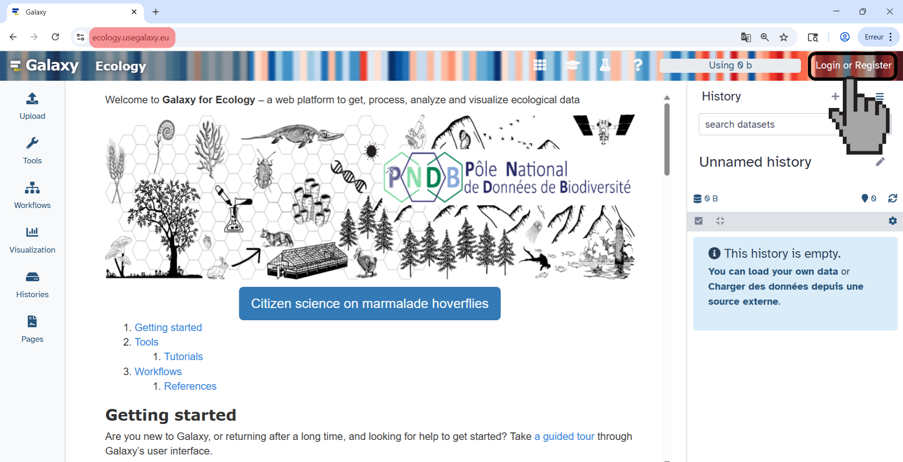
> >
> > On the login page, you can register a new account by clicking the button at the bottom-left:
> >
> > 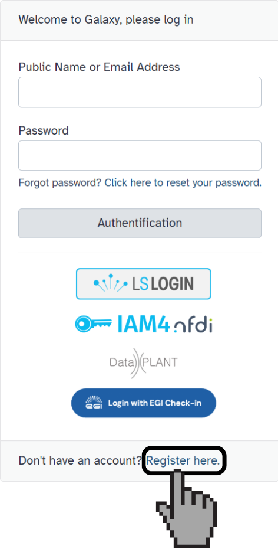 
> >
> > Once your account is created and you are logged in, you are ready to begin working with Galaxy!
> {: .hands_on}
>
>
>
> ## A quick tour of the Galaxy interface
>
> Here is a general overview of Galaxy’s main components. You’ll become familiar with these as we go through the tutorial:
>
> 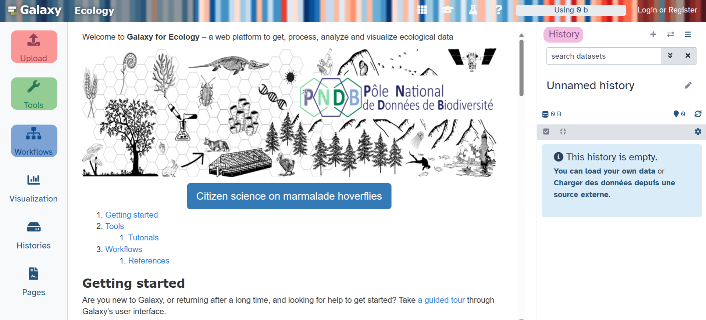
>
>
>
> > <details-title> Upload (Red)  </details-title>
> >
> >  This is where you upload your datasets.
> > 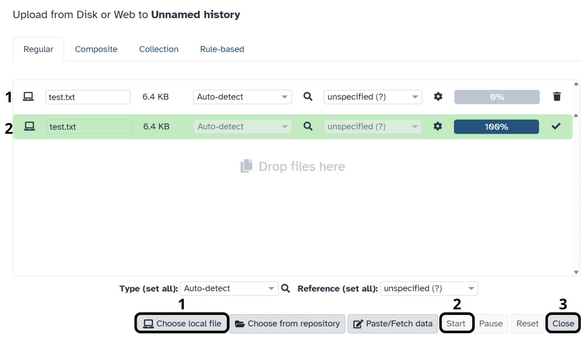
> > - Click **“Choose local file”** to select files from your computer  
> > - After the file appears in the panel, click **“Start”** to begin the upload  
> > - Once the upload is complete (green bar), click **“Close”**
> >
> > You can also use other options like:
> > - **“Paste/Fetch data”**: paste URLs to fetch data from the web  
> > - Upload specific formats like **shapefiles** (e.g. `.shp`, `.dbf`, etc.)
> {: .details}
>
> ---
>
> > <details-title>Tools (Green)</details-title>
> >
> >  This is where you'll find all the analytical power of Galaxy! Think of it as a vast library filled with programs designed to help you work with your data.
> >
> > 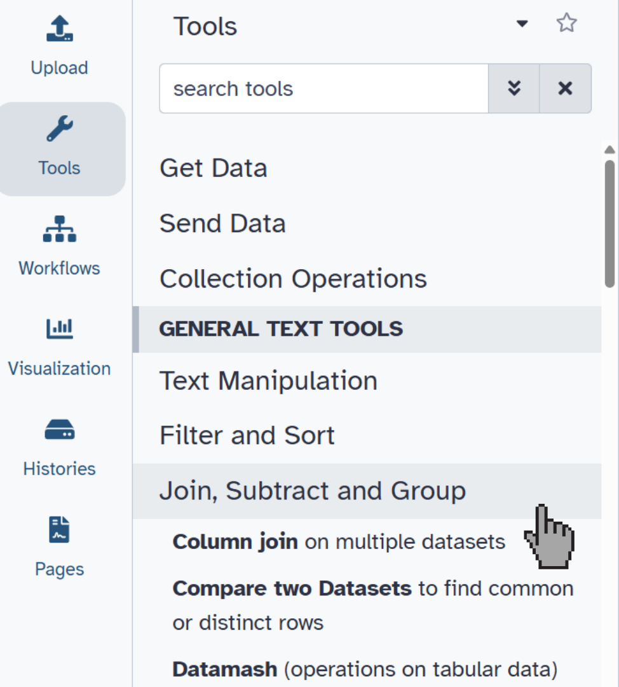
> >
> > - **Find Your Tool**: Use the search bar at the top to quickly locate tools by name or keyword.
> > - **Understand the Forms**: Every tool has a form with various input parameters. These forms are usually well-documented, explaining what each option does and what kind of input it expects.
> > - **Learn More**: At the bottom of a tool's page, you might find links to helpful tutorials, just like this one!
> > Galaxy's tools cover a wide range of functions. You'll find everything from basic tasks like converting data formats, filtering out unwanted information, and creating plots, to more advanced analyses such as statistical modeling or geospatial mapping.
> >
> > 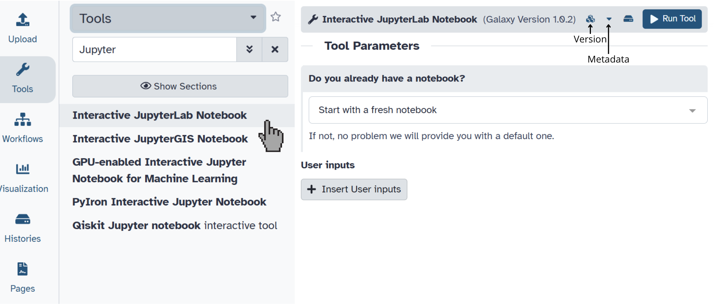
> >
> > Tools range from data conversion, filtering, and plotting, to more complex statistical or geospatial analysis.
> {: .details}
>
> ---
>
> > <details-title>Workflow (Blue)</details-title>
> >
> >  This is your control center for workflows, which are like pre-designed pipelines of tools that run automatically. Workflows help you automate complex analyses and ensure your steps are reproducible.
> >
> > 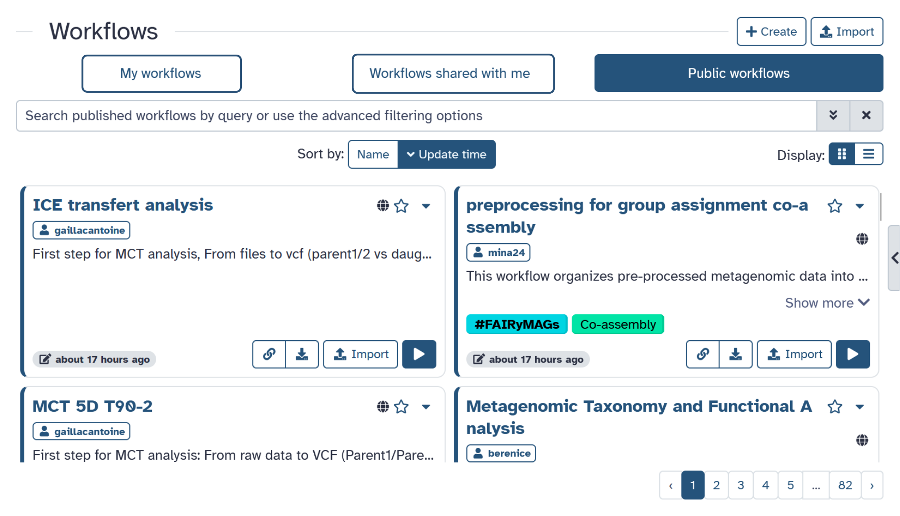
> >
> > - **Access your saved workflows**: Easily find and reuse any workflows you've created or imported.
> > - **Browse shared workflows**: Discover and use workflows created by the wider Galaxy community. This is a great way to learn and leverage existing solutions!
> > - **Manage workflows**: You can launch existing workflows to run them on new data, edit them to tweak their parameters, or create new workflows from scratch using Galaxy's intuitive visual editor
> {: .details}
>
> ---
>
> > <details-title>History Panel (Pink)</details-title>
> >
> >  This panel is your complete record of everything you do in Galaxy.
> >
> > 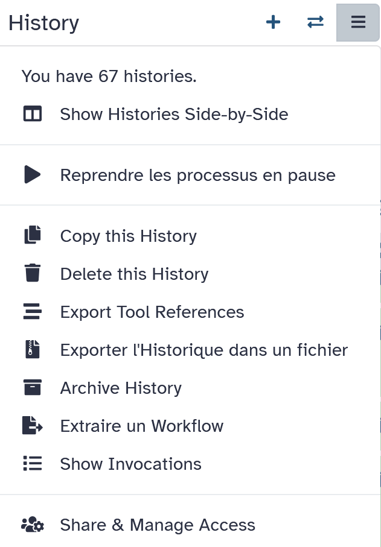
> >
> > - **Detailed Tracking**: The history panel shows every step you take: the files you upload, the tools you run, all the outputs generated, and even the exact parameters you used for each tool.
> > - **Reproducibility is Key** : Because every single step is logged, your work becomes fully reproducible. This means you (or anyone else) can go back and precisely recreate your analysis at any time, which is crucial for scientific rigor. 
> > - **Manage Multiple Projects**: You can easily manage multiple histories in parallel. This is super handy for keeping your work organized, especially if you're juggling different projects or experiments.
> >
> > Beyond just tracking, the history panel also lets you **name, annotate, and export** your analysis history. This makes it easy to share your work with colleagues or keep a detailed record for your own reference.
> {: .details}
{: .details}

---
# How the Workflow is Structured

The main workflow is composed of several **modular sub-workflows**, each one dedicated to a specific figure from the CCAMLR report. This design allows users to run only the figures they are interested in, making the process more efficient and adaptable.

**Available figure groups:**
- **Environmental maps**: Figures 1, 2, 3, 4, 5, 8, 9  
- **Biological indicators**: 2 sub-workflows for species monitoring (in progress)

Each figure has:
1. A dedicated sub-workflow
2. Its own input parameters and optional settings
3. A descriptive section in this tutorial

---

> <hands-on-title>Run the Main Workflow</hands-on-title>
>
> Start by opening the workflow here:  
>  **[State of the Environment – Antarctic](https://ecology.usegalaxy.eu/u/arthurb/w/worflow-for-representig-state-of-the-environment-in-antarctic)**
>
> 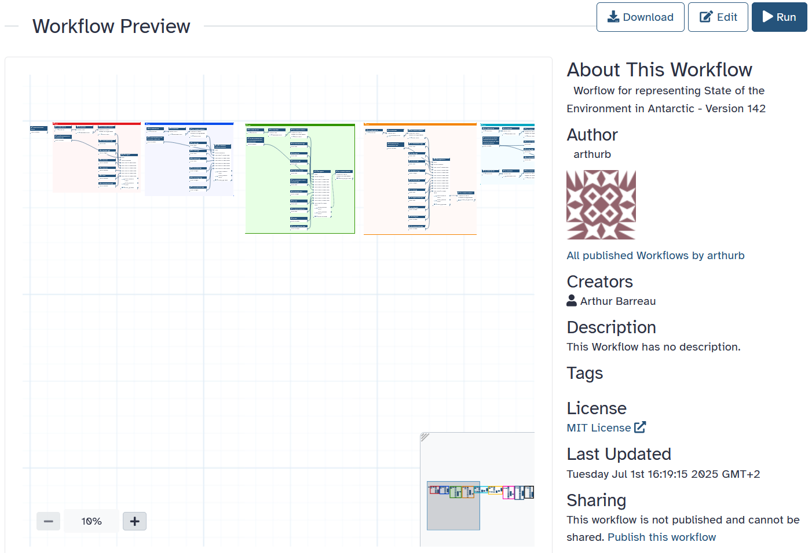
>
> Click **`Run`** to access the workflow form. Make sure you are logged in!
>
> 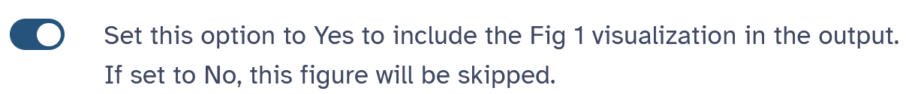
>
> Each figure has a toggle (Yes/No) to control whether it is executed. This allows you to run only selected figures. After toggling the figures you want, configure the input parameters below.
{: .hands_on}


# Figure 1 – Geographical Overview Map

This map provides a spatial overview of the **ASDs (Areas, Subareas, and Divisions)** used by CCAMLR, along with the locations of **CEMP monitoring sites**. It is designed to give a geographic reference for interpreting the rest of the report.

> <details-title>What data is used in this figure?</details-title>
>
> This figure uses data from **two different sources**:
>
> - **Background layer (Bathymetry)**:  
> The Antarctic seafloor bathymetry raster was downloaded from:  
> [https://gis.ccamlr.org/geoserver/www/GEBCO2024_5000.tif](https://gis.ccamlr.org/geoserver/www/GEBCO2024_5000.tif)
>
> - **ASD zones and CEMP sites**:  
> These vector layers were downloaded from the official CCAMLR GitHub repository:  
> [https://github.com/ccamlr/data](https://github.com/ccamlr/data)
{: .details}

> ### Data used in this figure
>
> - **Bathymetry (Background)**  
> Source: GEBCO dataset  
> [Download raster](https://gis.ccamlr.org/geoserver/www/GEBCO2024_5000.tif)
>
> - **ASD zones and CEMP sites (Vector data)**  
> Source: CCAMLR official GitHub  
> [GitHub repository](https://github.com/ccamlr/data)
{: .details}


> <hands-on-title>Configure Figure 1</hands-on-title>
>
>  **`Area Selection`**  
> *Type*: `Text`
>
> This first parameter lets you select which **geographic zones (ASDs)** you want to display on the map.    
> The map shows the Antarctic region, and the goal is to highlight the zones that will be studied in the rest of the report. To do this, simply type the codes of the areas you want to include, separated by **commas**. Available zones:    
> `881, 882, 883, 481, 482, 483, 484, 485, 486, 5841, 5842, 5843a, 5843b, 5844a, 5844b, 5851, 5852, 586, 587`    
> The order of the codes does not matter, and you can enter as many as you need.
> 
>  **`Multiplier`**  
> *Type*: `Integer`
>
> The **Multiplier** parameter allows you to adjust the **overall scaling** of the figure, including text size, symbol size, and resolution.  
> It gives you some freedom to fine-tune the final appearance of the map.
>
> 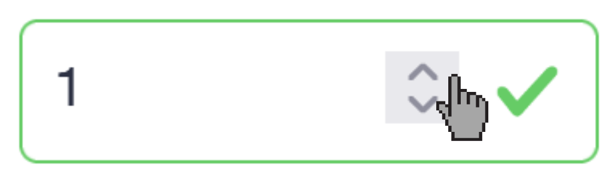
>
> You can change the value in two ways:
> - Use the small up/down arrows to increase or decrease the value  
> - Or simply type a number directly with your keyboard
>
> Tip: If the figure looks too small or too crowded, try increasing or decreasing this value to improve readability.
>
> #### **Display Toggles (Boolean Options)** 
>  
> This figure includes several **boolean options** that allow you to customize what is shown on the map. These options are useful for adjusting the level of detail or clarity in the visual output.
> 
> The map shows **ASD zones**, official marine subareas defined by the FAO for ecosystem monitoring. These areas divide the Southern Ocean into different units:
> -  The **red lines** represent ASD boundaries  
> - The **ASD labels** are the names/numbers of each zone  
> - The **CEMP sites** (CCAMLR Ecosystem Monitoring Program) are shown as **yellow dots**, these are long-term monitoring sites used for environmental data collection
> 
> You can toggle the display of each of these elements individually by selecting **Yes** or **No** in the workflow form.
> 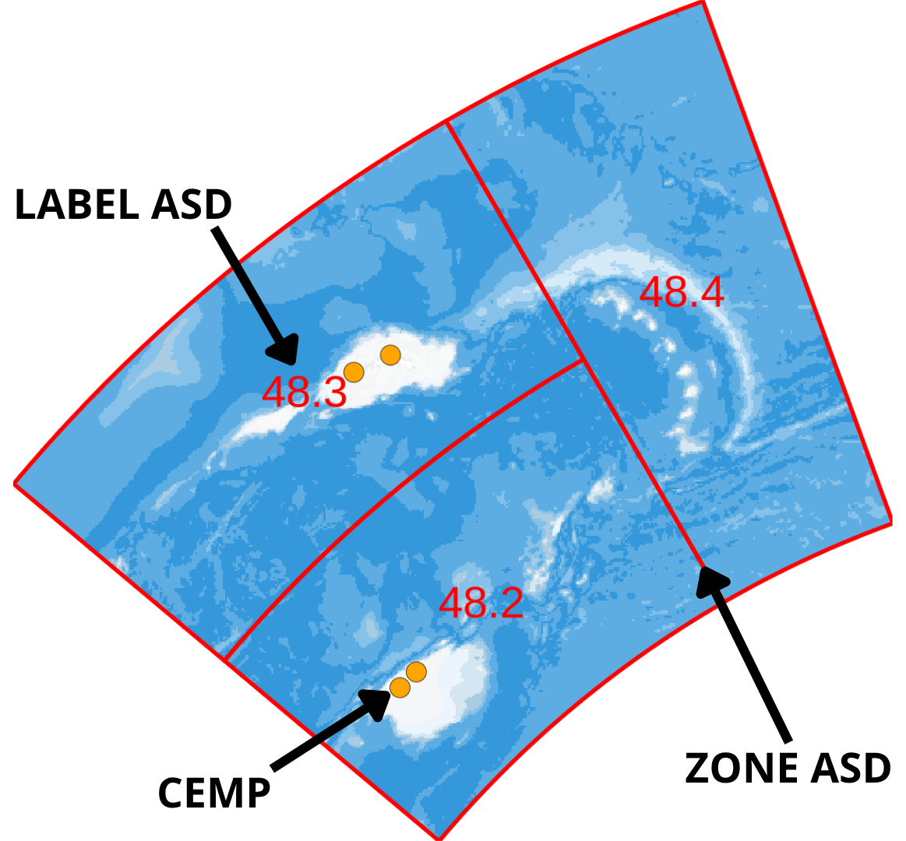
> 
>  **`Zone ASD`**  
> *Type*: `Boolean`  
> Show or hide the red borders of the CCAMLR-defined subareas
> 
>  **`Label ASD`**  
> *Type*: `Boolean`  
> Display the labels/names of the subareas directly on the map
> 
>  **`CEMP`**  
> *Type*: `Boolean`  
> Show or hide the yellow dots representing CEMP monitoring sites
>
>  **`PDF or PNG`**  
> *Type*: `Boolean`  
>
> This option lets you choose the **output format** of the figure:  
> - If set to `Yes`, the figure will be saved as a **PDF**  
> - If set to `No`, the figure will be saved as a **PNG**  
>
> Tip: PNG is recommended for quick viewing and reports, while PDF is useful for high-quality print or vector editing.
> 
>  **`Fill Entire Zone`**  
> *Type*: `Boolean`  
>
> By default, the map is shown on a full Antarctic projection. But if you’re focusing on specific zones, you might want to **zoom in and crop** the image to only show those selected areas.
>
> - If set to `Yes`, the map will be zoomed and cropped to fit the selected ASD zones  
> - If set to `No`, the full base map will be shown, with your selected zones highlighted
>
> Use this when you want a cleaner view focused only on your area of interest.
> 
>
{: .hands_on}

---


# Hands-on Sections
Below are a series of hand-on boxes, one for each tool in your workflow file.
Often you may wish to combine several boxes into one or make other adjustments such
as breaking the tutorial into sections, we encourage you to make such changes as you
see fit, this is just a starting point :

Anywhere you find the word "***TODO***", there is something that needs to be changed
depending on the specifics of your tutorial.

have fun!

## Get data

> <hands-on-title> Data Upload </hands-on-title>
>
> 1. Create a new history for this tutorial
> 2. Import the files from [Zenodo]({{ page.zenodo_link }}) or from
>    the shared data library (`GTN - Material` -> `{{ page.topic_name }}`
>     -> `{{ page.title }}`):
>
>    ```
>    
>    ```
>    ***TODO***: *Add the files by the ones on Zenodo here (if not added)*
>
>    ***TODO***: *Remove the useless files (if added)*
>
>    
>
>    
>
> 3. Rename the datasets
> 4. Check that the datatype
>
>    
>
> 5. Add to each database a tag corresponding to ...
>
>    
>
{: .hands_on}

# Title of the section usually corresponding to a big step in the analysis

It comes first a description of the step: some background and some theory.
Some image can be added there to support the theory explanation:


The idea is to keep the theory description before quite simple to focus more on the practical part.

***TODO***: *Consider adding a detail box to expand the theory*

> <details-title> More details about the theory </details-title>
>
> But to describe more details, it is possible to use the detail boxes which are expandable
>
{: .details}

A big step can have several subsections or sub steps:

## Sub-step with **Interactive JupyterLab Notebook**

> <hands-on-title> Task description </hands-on-title>
>
> 1.  with the following parameters:
>    - *"Do you already have a notebook?"*: `Load a previous notebook`
>        -  *"IPython Notebook"*: `output` (output of **Collapse Collection** )
>        - *"Execute notebook and return a new one."*: `Yes`
>    - In *"User inputs"*:
>        -  *"Insert User inputs"*
>            - *"Name for parameter"*: `subarea`
>            - *"Choose the input type"*: `Text`
>                - *"Select value"*: `{'id': 3, 'output_name': 'output'}`
>        -  *"Insert User inputs"*
>            - *"Name for parameter"*: `multiplier`
>            - *"Choose the input type"*: `Integer`
>                - *"Select value"*: `{'id': 4, 'output_name': 'output'}`
>        -  *"Insert User inputs"*
>            - *"Name for parameter"*: `ZoneXASD`
>            - *"Choose the input type"*: `Boolean`
>                - *"Select value"*: `Yes`
>        -  *"Insert User inputs"*
>            - *"Name for parameter"*: `LabelXASD`
>            - *"Choose the input type"*: `Boolean`
>                - *"Select value"*: `Yes`
>        -  *"Insert User inputs"*
>            - *"Name for parameter"*: `ZoneXCEMP`
>            - *"Choose the input type"*: `Boolean`
>                - *"Select value"*: `Yes`
>        -  *"Insert User inputs"*
>            - *"Name for parameter"*: `bbox`
>            - *"Choose the input type"*: `Boolean`
>                - *"Select value"*: `Yes`
>
>    ***TODO***: *Check parameter descriptions*
>
>    ***TODO***: *Consider adding a comment or tip box*
>
>    > <comment-title> short description </comment-title>
>    >
>    > A comment about the tool or something else. This box can also be in the main text
>    {: .comment}
>
{: .hands_on}

***TODO***: *Consider adding a question to test the learners understanding of the previous exercise*

> <question-title></question-title>
>
> 1. Question1?
> 2. Question2?
>
> > <solution-title></solution-title>
> >
> > 1. Answer for question1
> > 2. Answer for question2
> >
> {: .solution}
>
{: .question}

## Sub-step with **Interactive JupyterLab Notebook**

> <hands-on-title> Task description </hands-on-title>
>
> 1.  with the following parameters:
>    - *"Do you already have a notebook?"*: `Load a previous notebook`
>        -  *"IPython Notebook"*: `output` (output of **Collapse Collection** )
>        - *"Execute notebook and return a new one."*: `Yes`
>    - In *"User inputs"*:
>        -  *"Insert User inputs"*
>            - *"Name for parameter"*: `year`
>            - *"Additional optional description"*: `Enter the year (e.g.,'1978' to '2024')`
>            - *"Choose the input type"*: `Text`
>                - *"Select value"*: `{'id': 11, 'output_name': 'output'}`
>        -  *"Insert User inputs"*
>            - *"Name for parameter"*: `color`
>            - *"Choose the input type"*: `Optional Text`
>                - *"Select value"*: `{'id': 12, 'output_name': 'output'}`
>        -  *"Insert User inputs"*
>            - *"Name for parameter"*: `median`
>            - *"Choose the input type"*: `Text`
>                - *"Select value"*: `{'id': 13, 'output_name': 'output'}`
>        -  *"Insert User inputs"*
>            - *"Name for parameter"*: `pngWidth`
>            - *"Choose the input type"*: `Optional Integer`
>                - *"Select value"*: `{'id': 14, 'output_name': 'output'}`
>        -  *"Insert User inputs"*
>            - *"Name for parameter"*: `pngHeight`
>            - *"Choose the input type"*: `Optional Integer`
>                - *"Select value"*: `{'id': 15, 'output_name': 'output'}`
>        -  *"Insert User inputs"*
>            - *"Name for parameter"*: `pngResolution`
>            - *"Choose the input type"*: `Optional Integer`
>                - *"Select value"*: `{'id': 16, 'output_name': 'output'}`
>
>    ***TODO***: *Check parameter descriptions*
>
>    ***TODO***: *Consider adding a comment or tip box*
>
>    > <comment-title> short description </comment-title>
>    >
>    > A comment about the tool or something else. This box can also be in the main text
>    {: .comment}
>
{: .hands_on}

***TODO***: *Consider adding a question to test the learners understanding of the previous exercise*

> <question-title></question-title>
>
> 1. Question1?
> 2. Question2?
>
> > <solution-title></solution-title>
> >
> > 1. Answer for question1
> > 2. Answer for question2
> >
> {: .solution}
>
{: .question}

## Sub-step with **Interactive JupyterLab Notebook**

> <hands-on-title> Task description </hands-on-title>
>
> 1.  with the following parameters:
>    - *"Do you already have a notebook?"*: `Load a previous notebook`
>        -  *"IPython Notebook"*: `output` (output of **Collapse Collection** )
>        - *"Execute notebook and return a new one."*: `Yes`
>    - In *"User inputs"*:
>        -  *"Insert User inputs"*
>            - *"Name for parameter"*: `subarea`
>            - *"Choose the input type"*: `Text`
>                - *"Select value"*: `{'id': 19, 'output_name': 'output'}`
>        -  *"Insert User inputs"*
>            - *"Name for parameter"*: `year`
>            - *"Additional optional description"*: `Enter the year (e.g.,'1978' to '2024')`
>            - *"Choose the input type"*: `Text`
>                - *"Select value"*: `{'id': 20, 'output_name': 'output'}`
>        -  *"Insert User inputs"*
>            - *"Name for parameter"*: `month`
>            - *"Choose the input type"*: `Text`
>                - *"Select value"*: `{'id': 21, 'output_name': 'output'}`
>        -  *"Insert User inputs"*
>            - *"Name for parameter"*: `year_anomaly`
>            - *"Choose the input type"*: `Optional Text`
>                - *"Select value"*: `{'id': 22, 'output_name': 'output'}`
>        -  *"Insert User inputs"*
>            - *"Name for parameter"*: `Concentration and/or Anomalies`
>            - *"Choose the input type"*: `Text`
>                - *"Select value"*: `{'id': 23, 'output_name': 'output'}`
>        -  *"Insert User inputs"*
>            - *"Name for parameter"*: `multiplier`
>            - *"Choose the input type"*: `Integer`
>                - *"Select value"*: `{'id': 24, 'output_name': 'output'}`
>        -  *"Insert User inputs"*
>            - *"Name for parameter"*: `title`
>            - *"Choose the input type"*: `Text`
>                - *"Select value"*: `{'id': 25, 'output_name': 'output'}`
>        -  *"Insert User inputs"*
>            - *"Name for parameter"*: `legend_chose`
>            - *"Choose the input type"*: `Text`
>                - *"Select value"*: `{'id': 26, 'output_name': 'output'}`
>        -  *"Insert User inputs"*
>            - *"Name for parameter"*: `ASD`
>            - *"Choose the input type"*: `Boolean`
>                - *"Select value"*: `Yes`
>        -  *"Insert User inputs"*
>            - *"Name for parameter"*: `bbox`
>            - *"Choose the input type"*: `Boolean`
>                - *"Select value"*: `Yes`
>
>    ***TODO***: *Check parameter descriptions*
>
>    ***TODO***: *Consider adding a comment or tip box*
>
>    > <comment-title> short description </comment-title>
>    >
>    > A comment about the tool or something else. This box can also be in the main text
>    {: .comment}
>
{: .hands_on}

***TODO***: *Consider adding a question to test the learners understanding of the previous exercise*

> <question-title></question-title>
>
> 1. Question1?
> 2. Question2?
>
> > <solution-title></solution-title>
> >
> > 1. Answer for question1
> > 2. Answer for question2
> >
> {: .solution}
>
{: .question}

## Sub-step with **Interactive JupyterLab Notebook**

> <hands-on-title> Task description </hands-on-title>
>
> 1.  with the following parameters:
>    - *"Do you already have a notebook?"*: `Load a previous notebook`
>        -  *"IPython Notebook"*: `output` (output of **Collapse Collection** )
>        - *"Execute notebook and return a new one."*: `Yes`
>    - In *"User inputs"*:
>        -  *"Insert User inputs"*
>            - *"Name for parameter"*: `subarea`
>            - *"Choose the input type"*: `Optional Text`
>                - *"Select value"*: `{'id': 31, 'output_name': 'output'}`
>        -  *"Insert User inputs"*
>            - *"Name for parameter"*: `year`
>            - *"Additional optional description"*: `Enter the year (e.g.,'1978' to '2024')`
>            - *"Choose the input type"*: `Text`
>                - *"Select value"*: `{'id': 32, 'output_name': 'output'}`
>        -  *"Insert User inputs"*
>            - *"Name for parameter"*: `month`
>            - *"Choose the input type"*: `Text`
>                - *"Select value"*: `{'id': 33, 'output_name': 'output'}`
>        -  *"Insert User inputs"*
>            - *"Name for parameter"*: `nb_months`
>            - *"Choose the input type"*: `Integer`
>                - *"Select value"*: `{'id': 34, 'output_name': 'output'}`
>        -  *"Insert User inputs"*
>            - *"Name for parameter"*: `multiplier`
>            - *"Choose the input type"*: `Integer`
>                - *"Select value"*: `{'id': 35, 'output_name': 'output'}`
>        -  *"Insert User inputs"*
>            - *"Name for parameter"*: `title`
>            - *"Choose the input type"*: `Text`
>                - *"Select value"*: `{'id': 36, 'output_name': 'output'}`
>        -  *"Insert User inputs"*
>            - *"Name for parameter"*: `legend_chose`
>            - *"Choose the input type"*: `Text`
>                - *"Select value"*: `{'id': 37, 'output_name': 'output'}`
>        -  *"Insert User inputs"*
>            - *"Name for parameter"*: `Zone_ASD`
>            - *"Choose the input type"*: `Boolean`
>                - *"Select value"*: `Yes`
>        -  *"Insert User inputs"*
>            - *"Name for parameter"*: `Label_ASD`
>            - *"Choose the input type"*: `Boolean`
>                - *"Select value"*: `Yes`
>        -  *"Insert User inputs"*
>            - *"Name for parameter"*: `bbox`
>            - *"Choose the input type"*: `Boolean`
>                - *"Select value"*: `Yes`
>
>    ***TODO***: *Check parameter descriptions*
>
>    ***TODO***: *Consider adding a comment or tip box*
>
>    > <comment-title> short description </comment-title>
>    >
>    > A comment about the tool or something else. This box can also be in the main text
>    {: .comment}
>
{: .hands_on}

***TODO***: *Consider adding a question to test the learners understanding of the previous exercise*

> <question-title></question-title>
>
> 1. Question1?
> 2. Question2?
>
> > <solution-title></solution-title>
> >
> > 1. Answer for question1
> > 2. Answer for question2
> >
> {: .solution}
>
{: .question}

## Sub-step with **Interactive JupyterLab Notebook**

> <hands-on-title> Task description </hands-on-title>
>
> 1.  with the following parameters:
>    - *"Do you already have a notebook?"*: `Load a previous notebook`
>        -  *"IPython Notebook"*: `output` (output of **Collapse Collection** )
>        - *"Execute notebook and return a new one."*: `Yes`
>    - In *"User inputs"*:
>        -  *"Insert User inputs"*
>            - *"Name for parameter"*: `year`
>            - *"Additional optional description"*: `Enter the year (e.g.,'1978' to '2024')`
>            - *"Choose the input type"*: `Text`
>                - *"Select value"*: `{'id': 45, 'output_name': 'output'}`
>        -  *"Insert User inputs"*
>            - *"Name for parameter"*: `subarea`
>            - *"Choose the input type"*: `Optional Text`
>                - *"Select value"*: `{'id': 46, 'output_name': 'output'}`
>
>    ***TODO***: *Check parameter descriptions*
>
>    ***TODO***: *Consider adding a comment or tip box*
>
>    > <comment-title> short description </comment-title>
>    >
>    > A comment about the tool or something else. This box can also be in the main text
>    {: .comment}
>
{: .hands_on}

***TODO***: *Consider adding a question to test the learners understanding of the previous exercise*

> <question-title></question-title>
>
> 1. Question1?
> 2. Question2?
>
> > <solution-title></solution-title>
> >
> > 1. Answer for question1
> > 2. Answer for question2
> >
> {: .solution}
>
{: .question}

## Sub-step with **Interactive JupyterLab Notebook**

> <hands-on-title> Task description </hands-on-title>
>
> 1.  with the following parameters:
>    - *"Do you already have a notebook?"*: `Load a previous notebook`
>        -  *"IPython Notebook"*: `output` (output of **Collapse Collection** )
>        - *"Execute notebook and return a new one."*: `Yes`
>    - In *"User inputs"*:
>        -  *"Insert User inputs"*
>            - *"Name for parameter"*: `year`
>            - *"Additional optional description"*: `Enter the year (e.g.,'1978' to '2024')`
>            - *"Choose the input type"*: `Text`
>                - *"Select value"*: `{'id': 51, 'output_name': 'output'}`
>        -  *"Insert User inputs"*
>            - *"Name for parameter"*: `subarea`
>            - *"Choose the input type"*: `Optional Text`
>                - *"Select value"*: `{'id': 52, 'output_name': 'output'}`
>
>    ***TODO***: *Check parameter descriptions*
>
>    ***TODO***: *Consider adding a comment or tip box*
>
>    > <comment-title> short description </comment-title>
>    >
>    > A comment about the tool or something else. This box can also be in the main text
>    {: .comment}
>
{: .hands_on}

***TODO***: *Consider adding a question to test the learners understanding of the previous exercise*

> <question-title></question-title>
>
> 1. Question1?
> 2. Question2?
>
> > <solution-title></solution-title>
> >
> > 1. Answer for question1
> > 2. Answer for question2
> >
> {: .solution}
>
{: .question}

## Sub-step with **Interactive JupyterLab Notebook**

> <hands-on-title> Task description </hands-on-title>
>
> 1.  with the following parameters:
>    - *"Do you already have a notebook?"*: `Load a previous notebook`
>        -  *"IPython Notebook"*: `output` (output of **Collapse Collection** )
>        - *"Execute notebook and return a new one."*: `Yes`
>    - In *"User inputs"*:
>        -  *"Insert User inputs"*
>            - *"Name for parameter"*: `Copernicus Data User`
>            - *"Choose the input type"*: `Optional Dataset`
>                -  *"Select value"*: `output` (Input dataset)
>        -  *"Insert User inputs"*
>            - *"Name for parameter"*: `subarea`
>            - *"Choose the input type"*: `Text`
>                - *"Select value"*: `{'id': 56, 'output_name': 'output'}`
>        -  *"Insert User inputs"*
>            - *"Name for parameter"*: `MonthXmode`
>            - *"Choose the input type"*: `Text`
>                - *"Select value"*: `{'id': 57, 'output_name': 'output'}`
>        -  *"Insert User inputs"*
>            - *"Name for parameter"*: `multiplier`
>            - *"Choose the input type"*: `Integer`
>                - *"Select value"*: `{'id': 58, 'output_name': 'output'}`
>        -  *"Insert User inputs"*
>            - *"Name for parameter"*: `index_max`
>            - *"Choose the input type"*: `Floating point`
>                - *"Select value"*: `{'id': 59, 'output_name': 'output'}`
>        -  *"Insert User inputs"*
>            - *"Name for parameter"*: `legend_position`
>            - *"Choose the input type"*: `Text`
>                - *"Select value"*: `{'id': 60, 'output_name': 'output'}`
>        -  *"Insert User inputs"*
>            - *"Name for parameter"*: `nb_row`
>            - *"Choose the input type"*: `Optional Integer`
>                - *"Select value"*: `{'id': 61, 'output_name': 'output'}`
>        -  *"Insert User inputs"*
>            - *"Name for parameter"*: `title`
>            - *"Choose the input type"*: `Boolean`
>                - *"Select value"*: `Yes`
>        -  *"Insert User inputs"*
>            - *"Name for parameter"*: `ASD`
>            - *"Choose the input type"*: `Boolean`
>                - *"Select value"*: `Yes`
>        -  *"Insert User inputs"*
>            - *"Name for parameter"*: `bbox`
>            - *"Choose the input type"*: `Boolean`
>                - *"Select value"*: `Yes`
>
>    ***TODO***: *Check parameter descriptions*
>
>    ***TODO***: *Consider adding a comment or tip box*
>
>    > <comment-title> short description </comment-title>
>    >
>    > A comment about the tool or something else. This box can also be in the main text
>    {: .comment}
>
{: .hands_on}

***TODO***: *Consider adding a question to test the learners understanding of the previous exercise*

> <question-title></question-title>
>
> 1. Question1?
> 2. Question2?
>
> > <solution-title></solution-title>
> >
> > 1. Answer for question1
> > 2. Answer for question2
> >
> {: .solution}
>
{: .question}

## Sub-step with **Interactive JupyterLab Notebook**

> <hands-on-title> Task description </hands-on-title>
>
> 1.  with the following parameters:
>    - *"Do you already have a notebook?"*: `Load a previous notebook`
>        -  *"IPython Notebook"*: `output` (output of **Collapse Collection** )
>        - *"Execute notebook and return a new one."*: `Yes`
>    - In *"User inputs"*:
>        -  *"Insert User inputs"*
>            - *"Name for parameter"*: `data`
>            - *"Choose the input type"*: `Optional Dataset`
>                -  *"Select value"*: `output` (Input dataset)
>        -  *"Insert User inputs"*
>            - *"Name for parameter"*: `plotXmode`
>            - *"Choose the input type"*: `Text`
>                - *"Select value"*: `{'id': 68, 'output_name': 'output'}`
>        -  *"Insert User inputs"*
>            - *"Name for parameter"*: `col_chose`
>            - *"Choose the input type"*: `Optional Text`
>                - *"Select value"*: `{'id': 69, 'output_name': 'output'}`
>        -  *"Insert User inputs"*
>            - *"Name for parameter"*: `keyword`
>            - *"Choose the input type"*: `Optional Text`
>                - *"Select value"*: `{'id': 70, 'output_name': 'output'}`
>        -  *"Insert User inputs"*
>            - *"Name for parameter"*: `title`
>            - *"Choose the input type"*: `Optional Text`
>                - *"Select value"*: `{'id': 71, 'output_name': 'output'}`
>        -  *"Insert User inputs"*
>            - *"Name for parameter"*: `x`
>            - *"Choose the input type"*: `Optional Text`
>                - *"Select value"*: `{'id': 72, 'output_name': 'output'}`
>        -  *"Insert User inputs"*
>            - *"Name for parameter"*: `y`
>            - *"Choose the input type"*: `Optional Text`
>                - *"Select value"*: `{'id': 73, 'output_name': 'output'}`
>        -  *"Insert User inputs"*
>            - *"Name for parameter"*: `log`
>            - *"Choose the input type"*: `Boolean`
>                - *"Select value"*: `Yes`
>        -  *"Insert User inputs"*
>            - *"Name for parameter"*: `year`
>            - *"Choose the input type"*: `Optional Text`
>                - *"Select value"*: `{'id': 75, 'output_name': 'output'}`
>        -  *"Insert User inputs"*
>            - *"Name for parameter"*: `width`
>            - *"Choose the input type"*: `Integer`
>                - *"Select value"*: `{'id': 76, 'output_name': 'output'}`
>        -  *"Insert User inputs"*
>            - *"Name for parameter"*: `res`
>            - *"Choose the input type"*: `Integer`
>                - *"Select value"*: `{'id': 77, 'output_name': 'output'}`
>
>    ***TODO***: *Check parameter descriptions*
>
>    ***TODO***: *Consider adding a comment or tip box*
>
>    > <comment-title> short description </comment-title>
>    >
>    > A comment about the tool or something else. This box can also be in the main text
>    {: .comment}
>
{: .hands_on}

***TODO***: *Consider adding a question to test the learners understanding of the previous exercise*

> <question-title></question-title>
>
> 1. Question1?
> 2. Question2?
>
> > <solution-title></solution-title>
> >
> > 1. Answer for question1
> > 2. Answer for question2
> >
> {: .solution}
>
{: .question}

## Sub-step with **Interactive JupyterLab Notebook**

> <hands-on-title> Task description </hands-on-title>
>
> 1.  with the following parameters:
>    - *"Do you already have a notebook?"*: `Load a previous notebook`
>        -  *"IPython Notebook"*: `output` (output of **Collapse Collection** )
>        - *"Execute notebook and return a new one."*: `Yes`
>    - In *"User inputs"*:
>        -  *"Insert User inputs"*
>            - *"Name for parameter"*: `data`
>            - *"Choose the input type"*: `Optional Dataset`
>                -  *"Select value"*: `output` (Input dataset)
>        -  *"Insert User inputs"*
>            - *"Name for parameter"*: `col_Y`
>            - *"Choose the input type"*: `Text`
>                - *"Select value"*: `{'id': 81, 'output_name': 'output'}`
>        -  *"Insert User inputs"*
>            - *"Name for parameter"*: `ylim`
>            - *"Choose the input type"*: `Optional Text`
>                - *"Select value"*: `{'id': 82, 'output_name': 'output'}`
>        -  *"Insert User inputs"*
>            - *"Name for parameter"*: `col_groupe_line`
>            - *"Choose the input type"*: `Optional Text`
>                - *"Select value"*: `{'id': 83, 'output_name': 'output'}`
>        -  *"Insert User inputs"*
>            - *"Name for parameter"*: `col_groupe_point`
>            - *"Choose the input type"*: `Optional Text`
>                - *"Select value"*: `{'id': 84, 'output_name': 'output'}`
>        -  *"Insert User inputs"*
>            - *"Name for parameter"*: `title`
>            - *"Choose the input type"*: `Optional Text`
>                - *"Select value"*: `{'id': 85, 'output_name': 'output'}`
>        -  *"Insert User inputs"*
>            - *"Name for parameter"*: `x`
>            - *"Choose the input type"*: `Optional Text`
>                - *"Select value"*: `{'id': 86, 'output_name': 'output'}`
>        -  *"Insert User inputs"*
>            - *"Name for parameter"*: `y`
>            - *"Choose the input type"*: `Optional Text`
>                - *"Select value"*: `{'id': 87, 'output_name': 'output'}`
>        -  *"Insert User inputs"*
>            - *"Name for parameter"*: `width`
>            - *"Choose the input type"*: `Integer`
>                - *"Select value"*: `{'id': 88, 'output_name': 'output'}`
>        -  *"Insert User inputs"*
>            - *"Name for parameter"*: `res`
>            - *"Choose the input type"*: `Integer`
>                - *"Select value"*: `{'id': 89, 'output_name': 'output'}`
>
>    ***TODO***: *Check parameter descriptions*
>
>    ***TODO***: *Consider adding a comment or tip box*
>
>    > <comment-title> short description </comment-title>
>    >
>    > A comment about the tool or something else. This box can also be in the main text
>    {: .comment}
>
{: .hands_on}

***TODO***: *Consider adding a question to test the learners understanding of the previous exercise*

> <question-title></question-title>
>
> 1. Question1?
> 2. Question2?
>
> > <solution-title></solution-title>
> >
> > 1. Answer for question1
> > 2. Answer for question2
> >
> {: .solution}
>
{: .question}

## Sub-step with **Interactive JupyterLab Notebook**

> <hands-on-title> Task description </hands-on-title>
>
> 1.  with the following parameters:
>    - *"Do you already have a notebook?"*: `Load a previous notebook`
>        -  *"IPython Notebook"*: `output` (output of **Collapse Collection** )
>        - *"Execute notebook and return a new one."*: `Yes`
>    - In *"User inputs"*:
>        -  *"Insert User inputs"*
>            - *"Name for parameter"*: `graph_selection`
>            - *"Choose the input type"*: `Text`
>                - *"Select value"*: `{'id': 44, 'output_name': 'output'}`
>        -  *"Insert User inputs"*
>            - *"Name for parameter"*: `year`
>            - *"Additional optional description"*: `Enter the year (e.g.,'1978' to '2024')`
>            - *"Choose the input type"*: `Text`
>                - *"Select value"*: `{'id': 45, 'output_name': 'output'}`
>        -  *"Insert User inputs"*
>            - *"Name for parameter"*: `subarea`
>            - *"Choose the input type"*: `Optional Text`
>                - *"Select value"*: `{'id': 46, 'output_name': 'output'}`
>        -  *"Insert User inputs"*
>            - *"Name for parameter"*: `txt`
>            - *"Choose the input type"*: `Optional Dataset`
>                -  *"Select value"*: `request` (output of **Copernicus Climate Data Store** )
>        -  *"Insert User inputs"*
>            - *"Name for parameter"*: `data`
>            - *"Choose the input type"*: `Optional Dataset`
>                -  *"Select value"*: `ofilename` (output of **Copernicus Climate Data Store** )
>
>    ***TODO***: *Check parameter descriptions*
>
>    ***TODO***: *Consider adding a comment or tip box*
>
>    > <comment-title> short description </comment-title>
>    >
>    > A comment about the tool or something else. This box can also be in the main text
>    {: .comment}
>
{: .hands_on}

***TODO***: *Consider adding a question to test the learners understanding of the previous exercise*

> <question-title></question-title>
>
> 1. Question1?
> 2. Question2?
>
> > <solution-title></solution-title>
> >
> > 1. Answer for question1
> > 2. Answer for question2
> >
> {: .solution}
>
{: .question}

## Sub-step with **Interactive JupyterLab Notebook**

> <hands-on-title> Task description </hands-on-title>
>
> 1.  with the following parameters:
>    - *"Do you already have a notebook?"*: `Load a previous notebook`
>        -  *"IPython Notebook"*: `output` (output of **Collapse Collection** )
>        - *"Execute notebook and return a new one."*: `Yes`
>    - In *"User inputs"*:
>        -  *"Insert User inputs"*
>            - *"Name for parameter"*: `graph_selection`
>            - *"Choose the input type"*: `Text`
>                - *"Select value"*: `{'id': 50, 'output_name': 'output'}`
>        -  *"Insert User inputs"*
>            - *"Name for parameter"*: `year`
>            - *"Additional optional description"*: `Enter the year (e.g.,'1978' to '2024')`
>            - *"Choose the input type"*: `Text`
>                - *"Select value"*: `{'id': 51, 'output_name': 'output'}`
>        -  *"Insert User inputs"*
>            - *"Name for parameter"*: `subarea`
>            - *"Choose the input type"*: `Optional Text`
>                - *"Select value"*: `{'id': 52, 'output_name': 'output'}`
>        -  *"Insert User inputs"*
>            - *"Name for parameter"*: `txt`
>            - *"Choose the input type"*: `Optional Dataset`
>                -  *"Select value"*: `request` (output of **Copernicus Climate Data Store** )
>        -  *"Insert User inputs"*
>            - *"Name for parameter"*: `data`
>            - *"Choose the input type"*: `Optional Dataset`
>                -  *"Select value"*: `ofilename` (output of **Copernicus Climate Data Store** )
>
>    ***TODO***: *Check parameter descriptions*
>
>    ***TODO***: *Consider adding a comment or tip box*
>
>    > <comment-title> short description </comment-title>
>    >
>    > A comment about the tool or something else. This box can also be in the main text
>    {: .comment}
>
{: .hands_on}

***TODO***: *Consider adding a question to test the learners understanding of the previous exercise*

> <question-title></question-title>
>
> 1. Question1?
> 2. Question2?
>
> > <solution-title></solution-title>
> >
> > 1. Answer for question1
> > 2. Answer for question2
> >
> {: .solution}
>
{: .question}


## Re-arrange

To create the template, each step of the workflow had its own subsection.

***TODO***: *Re-arrange the generated subsections into sections or other subsections.
Consider merging some hands-on boxes to have a meaningful flow of the analyses*

# Conclusion

Sum up the tutorial and the key takeaways here. We encourage adding an overview image of the
pipeline used.