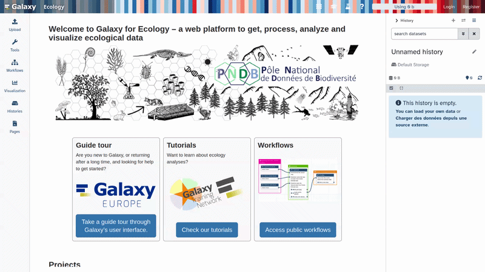
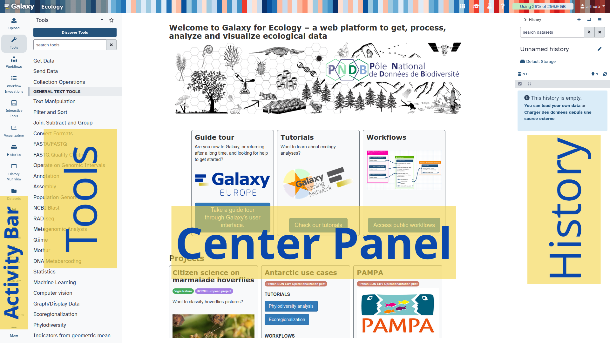

Ce tutoriel vous guide dans le projet Moorev([https://moorev.fr/](https://moorev.fr/)). Vous allez découvrir comment les images et vidéos collectées par le projet sont analysées grâce à des outils d'intelligence artificielle disponibles sur Galaxy : d'abord un modèle généraliste qui fait un premier travail de détection, puis un modèle entraîné spécifiquement sur les espèces du projet pour une analyse plus précise et 
automatisée.

Tout se passe dans **Galaxy**, une plateforme en ligne gratuite qui vous donne accès à des outils 
d'analyse puissants, directement depuis votre navigateur — sans installation, sans programmation.

> <details-title>En savoir plus sur le projet MOOREV</details-title>
>
> **MOOREV** : Microclimats et outils d'observation des réponses du vivant sur les fonds marins 
> **Observer les interactions entre espèces marines face aux gradients microclimatiques sur l'estran**
>
> Le projet MOOREV, porté par Nadine Le Bris (Sorbonne Université, Station Marine de Concarneau), 
> avec le soutien du Muséum National d'Histoire Naturelle, du CNRS et de la Fondation de France, 
> a été lancé en 2022. Son objectif : mieux comprendre et faire comprendre les effets des 
> perturbations climatiques sur la biodiversité du littoral.
>
> L'approche repose sur des méthodes d'imagerie sous-marine pour observer les espèces benthiques 
> à l'échelle individuelle, sur différents habitats de l'estran. Des groupes de scolaires 
> répètent des acquisitions de données sur leurs sites d'étude — labellisés par le programme 
> Aires Marines Éducatives de l'Office Français de la Biodiversité — au fil des cycles de marée, 
> des saisons et des années.
>
> Le projet associe chercheurs et professionnels de l'éducation à l'environnement, et est 
> co-construit avec des classes et leurs enseignants, en utilisant le littoral comme laboratoire 
> naturel. À terme, il vise à soutenir la mise en œuvre de mesures de protection et de 
> conservation, en tenant compte des interactions entre changement climatique et socio-écosystèmes 
> marins.
>
{: .details}

Le pipeline suit six étapes :


Ce tutoriel vous guide dans la construction d'un **pipeline complet d'annotation et d'entraînement** pour la détection d'espèces marines sur Galaxy. En partant de simples images ou vidéos, vous obtiendrez un modèle YOLO personnalisé capable de détecter et segmenter automatiquement vos espèces d'intérêt.

Le pipeline repose sur six outils Galaxy complémentaires :

| Étape | Outil | Rôle |
|-------|-------|------|
| 1 | **SAM3** | Annotation automatique par prompt textuel |
| 2 | **COCO to LabelMe** | Conversion des annotations pour la correction manuelle |
| 3 | **AnyLabeling** *(outil interactif)* | Correction et validation des annotations |
| 4 | **JSON to YOLO** | Conversion au format d'entraînement YOLO |
| 5 | **YOLO Training** | Entraînement du modèle de détection |
| 6 | **YOLO Prediction** | Prédiction sur de nouvelles images |


> <agenda-title>Dans ce tutoriel, nous allons couvrir :</agenda-title>
>
> 1. TOC
> {:toc}
>
{: .agenda}

> <details-title>Première fois sur Galaxy ?</details-title>
>
> **Se connecter à Galaxy**
> 1. Ouvrez votre navigateur internet préféré
> 2. Rendez-vous sur l'instance Galaxy Écologie : [ecology.usegalaxy.eu](https://ecology.usegalaxy.eu/)
> 3. Connectez-vous ou créez un compte gratuit
>
>  
> 
> La page d'accueil de Galaxy est divisée en quatre sections :
> 
> * La barre d'activités à gauche : _C'est ici que vous naviguez entre les ressources de Galaxy (Outils, Workflows, Historiques, etc.)_
> * Le panneau d'activité actif à gauche : _Par défaut, l'activité  **Outils** est sélectionnée et son panneau est déplié_
> * Le panneau de visualisation au centre : _La zone principale pour visualiser et interagir avec vos analyses_
> * L'historique des analyses et des fichiers à droite : _Affiche votre historique "actuel", c'est-à-dire l'endroit où seront stockés tous les nouveaux fichiers de votre analyse_
> 
>  
> 
> La première fois que vous utilisez Galaxy, aucun fichier ne sera présent dans votre panneau d'historique.
> 
{: .details}
# Vue d'ensemble du pipeline

Voici le chemin que vos images vont suivre, de leur état brut jusqu'à la détection automatique des espèces :

```
Images brutes
     │
     ▼
┌─────────────────┐
│  SAM3           │  ← Annotation automatique par prompt
│  (prompt: "jellyfish") │
└────────┬────────┘
         │ Annotation COCO (JSON)
         ▼
┌─────────────────┐
│  COCO to LabelMe│  ← Conversion pour l'outil d'annotation
└────────┬────────┘
         │ Fichiers JSON LabelMe (un par image)
         ▼
┌─────────────────┐
│  AnyLabeling    │  ← Correction manuelle des masques
│  (interactif)   │
└────────┬────────┘
         │ Fichiers JSON corrigés
         ▼
┌─────────────────┐
│  JSON to YOLO   │  ← Conversion au format YOLO
└────────┬────────┘
         │ Fichiers .txt YOLO + images
         ▼
┌─────────────────┐
│  YOLO Training  │  ← Entraînement du modèle
└────────┬────────┘
         │ Modèle best.pt
         ▼
┌─────────────────┐
│  YOLO Prediction│  ← Prédiction sur nouvelles images
└─────────────────┘
```

> <tip-title>Utiliser ce pipeline comme workflow Galaxy</tip-title>
>
> Chacune des étapes ci-dessous peut être enchaînée dans un **workflow Galaxy** réutilisable. Une fois les étapes effectuées manuellement, vous pouvez extraire votre historique en workflow via le menu **Workflow > Extract Workflow from History**.
>
{: .tip}

# Charger les données dans Galaxy

Pour ce tutoriel, nous allons utiliser des images de méduses (*Pelagia noctiluca*) issues du projet Moorev.

> <hands-on-title>Importer les images d'exemple</hands-on-title>
>
> Importez les fichiers suivants dans Galaxy :
>
> ```
> https://zenodo.org/records/19890809/files/Moorev-jellyfish.jpg
> https://zenodo.org/records/19890809/files/Moorev-jellyfish-2.jpg
> https://zenodo.org/records/19890809/files/Moorev-jellyfish-3.jpg
> ```
>
> > <tip-title>Téléverser les données dans Galaxy</tip-title>
> >
> > * Copiez le lien correspondant au fichier à importer
> > * 1- Cliquez sur  **Upload** en haut du panneau d'activité
> > * 2- Sélectionnez  **Paste/Fetch Data**
> > * 3- Collez les liens dans le champ de texte (un par ligne)
> > * 4- Cliquez sur **Start**
> > * 5- Cliquez sur **Close** pour fermer la fenêtre
> >
> > {: style="width:80%; display:block; margin:auto;"}
> >
> {: .tip}
>
{: .hands_on}

# Étape 1 : Annotation automatique avec SAM3

La première étape consiste à annoter automatiquement les images grâce à SAM3. Le modèle détecte et segmente les objets correspondant à votre prompt textuel, sans nécessiter d'annotations préalables.

> <comment-title>Pourquoi utiliser SAM3 comme point de départ ?</comment-title>
>
> Annoter manuellement des centaines d'images est une tâche longue et fastidieuse. SAM3 génère une première annotation automatique que l'on peut ensuite corriger, ce qui réduit considérablement le temps de travail. En pratique, SAM3 produit de très bons résultats sur des sujets courants, mais peut nécessiter des corrections sur des espèces marines peu représentées dans ses données d'entraînement.
>
{: .comment}

## Paramétrage de SAM3

> <hands-on-title>Annoter automatiquement les méduses</hands-on-title>
>
> 1.  avec ces paramètres :
>
>    -  *"Model data"* : `Segment Anything Model 3 (SAM 3)` (par défaut)
>    -  *"Input type"* : `One or more images`
>    -  *"Input images"* : sélectionnez toutes vos images (`Moorev-jellyfish.jpg`, `Moorev-jellyfish-2.jpg`, `Moorev-jellyfish-3.jpg`)
>    -  *"Output formats"* : `COCO`
>    -  *"Text prompt"* : `jellyfish`
>    -  *"Confidence threshold"* : `0.5`
>    -  *"Show bounding boxes on annotated output"* : `Yes`
>    -  *"Normalize outputs?"* : `No`
>
>    > <tip-title>Choisir le bon prompt</tip-title>
>    >
>    > Le prompt textuel doit décrire l'objet à segmenter en **anglais**, en termes simples et précis.
>    > Pour plusieurs espèces simultanément : `jellyfish, shrimp, fish`
>    >
>    > Ajustez le seuil de confiance (`Confidence threshold`) selon la qualité des résultats :
>    > - **Valeur faible (0.1–0.3)** : plus de détections, mais aussi plus de faux positifs
>    > - **Valeur élevée (0.6–0.9)** : détections plus sûres, mais risque de manquer des objets
>    >
>    {: .tip}
>
> 2. Cliquez sur **Execute**
>
>    > <comment-title>Temps de traitement</comment-title>
>    >
>    > Le traitement peut prendre quelques minutes. Patientez jusqu'à ce que les sorties apparaissent en vert dans l'historique.
>    >
>    {: .comment}
>
> 3. Une fois terminé, vous obtenez dans votre historique :
>    - **Annotation COCO** : `annotations.json` — les masques de segmentation au format COCO
>    - **Annotated Outputs** : la collection d'images annotées (pour vérification visuelle)
>
> 4. Vérifiez visuellement les résultats en cliquant sur  sur la collection **Annotated Outputs**.
>
>    {: style="width:75%; display:block; margin:auto;"}
>
>    > <warning-title>Annotations imparfaites ?</warning-title>
>    >
>    > Il est normal que certaines annotations soient incorrectes (masques mal délimités, objets manqués, faux positifs). C'est précisément pour cela que l'étape de correction manuelle avec AnyLabeling est indispensable avant l'entraînement.
>    >
>    {: .warning}
>
{: .hands_on}

# Étape 2 : Conversion COCO → LabelMe

Les annotations générées par SAM3 sont au format COCO. Pour les corriger dans l'outil interactif AnyLabeling, il faut d'abord les convertir au format LabelMe (un fichier JSON par image).

## Paramétrage de l'outil COCO to LabelMe

> <hands-on-title>Convertir les annotations COCO au format LabelMe</hands-on-title>
>
> 1.  avec ces paramètres :
>
>    -  *"COCO annotation file"* : `Annotation COCO` (la sortie de SAM3)
>    -  *"Image path mode"* : `Simple — ../filename`
>
>    > <details-title>Comprendre les modes de chemin d'image</details-title>
>    >
>    > Le mode de chemin contrôle comment le champ `imagePath` est écrit dans chaque fichier JSON de sortie, ce qui indique à AnyLabeling où trouver les images correspondantes.
>    >
>    > | Mode | Chemin écrit | Quand l'utiliser |
>    > |------|-------------|-----------------|
>    > | **Simple** | `../filename.jpg` | Images dans le dossier parent |
>    > | **Custom** | `<votre chemin>/filename.jpg` | Structure personnalisée |
>    >
>    > Pour la plupart des usages avec AnyLabeling sur Galaxy, le mode **Simple** est recommandé.
>    >
>    {: .details}
>
> 2. Cliquez sur **Execute**
>
> 3. La sortie est une collection **LabelMe JSON annotations** contenant un fichier `.json` par image.
>
>    > <comment-title>Un fichier JSON par image</comment-title>
>    >
>    > Chaque fichier JSON LabelMe correspond à une image et contient les annotations sous forme de polygones (`shapes`). Ces fichiers peuvent être ouverts directement dans LabelMe ou AnyLabeling pour correction.
>    >
>    {: .comment}
>
{: .hands_on}

# Étape 3 : Correction manuelle avec AnyLabeling

AnyLabeling est un outil d'annotation interactif disponible sur Galaxy. Il vous permet de visualiser les annotations générées par SAM3, de corriger les masques imparfaits, de supprimer les faux positifs et d'ajouter les annotations manquantes.

> <hands-on-title>Lancer AnyLabeling et corriger les annotations</hands-on-title>
>
> 1.  avec ces paramètres :
>
>    -  *"Input images"* : sélectionnez toutes vos images source
>    -  *"Input JSON annotations"* : la collection **LabelMe JSON annotations** (sortie de l'étape précédente)
>
> 2. Cliquez sur **Execute** pour lancer l'outil interactif
>
>    > <tip-title>Accéder à l'interface AnyLabeling</tip-title>
>    >
>    > Une fois l'outil lancé, un lien apparaît dans l'historique Galaxy. Cliquez dessus pour ouvrir l'interface AnyLabeling dans un nouvel onglet.
>    >
>    > {: style="width:60%; display:block; margin:auto;"}
>    >
>    {: .tip}
>
> 3. Dans l'interface AnyLabeling :
>
>    **Pour chaque image, vérifiez et corrigez les annotations :**
>
>    -  Parcourez les images via les flèches de navigation
>    - Sélectionnez un polygone pour le modifier : cliquez dessus, puis déplacez les points de contrôle
>    - Supprimez un faux positif : sélectionnez le polygone et appuyez sur `Suppr`
>    - Ajoutez une annotation manquante : utilisez l'outil **Polygon** dans la barre d'outils
>    - Renommez une classe : double-cliquez sur le label dans la liste de droite
>
>    > <tip-title>Raccourcis clavier utiles dans AnyLabeling</tip-title>
>    >
>    > | Raccourci | Action |
>    > |-----------|--------|
>    > | `A` / `D` | Image précédente / suivante |
>    > | `Ctrl+S` | Sauvegarder les annotations |
>    > | `E` | Créer un nouveau polygone |
>    > | `Del` | Supprimer l'annotation sélectionnée |
>    > | `Ctrl+Z` | Annuler la dernière action |
>    > | `+` / `-` | Zoom avant / arrière |
>    >
>    {: .tip}
>
>    > <comment-title>Conseils pour une correction efficace</comment-title>
>    >
>    > - Concentrez-vous sur les **bords des masques** : un masque bien délimité est plus important qu'un masque parfaitement précis au pixel près pour l'entraînement YOLO.
>    > - Soyez **cohérent dans le nommage des classes** : utilisez toujours le même nom (ex. `jellyfish` et non `Jellyfish` ou `méduse`).
>    > - Si une image ne contient aucun objet d'intérêt, conservez-la avec **aucune annotation** (image négative) : elle aide le modèle à éviter les faux positifs.
>    >
>    {: .comment}
>
> 4. Sauvegardez régulièrement votre travail (`Ctrl+S`)
>
> 5. Une fois la correction terminée, récupérez les fichiers JSON corrigés depuis la sortie de l'outil interactif dans votre historique Galaxy.
>
{: .hands_on}

> <details-title>Que faire si AnyLabeling n'est pas disponible sur votre instance ?</details-title>
>
> Si l'outil interactif AnyLabeling n'est pas disponible sur votre instance Galaxy, vous pouvez :
> 1. Télécharger les fichiers JSON LabelMe ()
> 2. Installer [AnyLabeling](https://github.com/vietanhdev/anylabeling) localement sur votre ordinateur
> 3. Corriger les annotations localement
> 4. Ré-importer les fichiers JSON corrigés dans Galaxy
>
{: .details}

# Étape 4 : Conversion LabelMe/AnyLabeling → YOLO

Les annotations corrigées dans AnyLabeling sont au format JSON. Pour entraîner un modèle YOLO, il faut les convertir au format texte YOLO (un fichier `.txt` par image, avec les coordonnées normalisées des polygones).

## Préparer le fichier de classes

Avant de lancer la conversion, vous devez créer un fichier texte listant vos classes (une par ligne).

> <hands-on-title>Créer le fichier de classes</hands-on-title>
>
> 1. Dans Galaxy, cliquez sur  **Upload**
> 2. Sélectionnez **Paste/Fetch Data**
> 3. Dans le champ de texte, collez le contenu de votre fichier de classes. Par exemple pour les méduses :
>
>    ```
>    jellyfish
>    ```
>
>    Pour plusieurs classes :
>    ```
>    jellyfish
>    shrimp
>    fish
>    ```
>
> 4. Donnez un nom au fichier : `class_names.txt`
> 5. Définissez le **Type** sur `txt`
> 6. Cliquez sur **Start** puis **Close**
>
{: .hands_on}

## Paramétrage de l'outil JSON to YOLO

> <hands-on-title>Convertir les annotations JSON au format YOLO</hands-on-title>
>
> 1.  avec ces paramètres :
>
>    -  *"Input label files"* : la collection de fichiers JSON corrigés (sortie d'AnyLabeling)
>    -  *"Class file"* : `class_names.txt`
>
> 2. Cliquez sur **Execute**
>
> 3. La sortie est une collection **YOLO text files** contenant un fichier `.txt` par image.
>
>    > <details-title>Format d'un fichier YOLO segmentation</details-title>
>    >
>    > Chaque ligne d'un fichier YOLO segmentation suit ce format :
>    > ```
>    > <class_id> <x1> <y1> <x2> <y2> ... <xn> <yn>
>    > ```
>    > - `class_id` : l'index de la classe (0 pour `jellyfish` si c'est la première ligne du fichier de classes)
>    > - `x1 y1 ... xn yn` : les coordonnées du polygone, normalisées entre 0 et 1
>    >
>    > Exemple pour une méduse :
>    > ```
>    > 0 0.423 0.312 0.456 0.298 0.489 0.315 0.456 0.334
>    > ```
>    >
>    {: .details}
>
{: .hands_on}

# Étape 5 : Entraînement du modèle YOLO

Vous disposez maintenant d'images annotées au format YOLO. L'outil YOLO Training va automatiquement diviser votre dataset (entraînement / validation / test) et entraîner un modèle de segmentation.

## Paramétrage de l'entraînement

> <hands-on-title>Entraîner le modèle YOLO</hands-on-title>
>
> 1.  avec ces paramètres :
>
>    -  *"Input Images"* : sélectionnez toutes vos images sources (JPG/PNG)
>    -  *"Input YOLO txt files"* : la collection **YOLO text files** (sortie de l'étape précédente)
>    -  *"Choose pretrained YOLO model"* : `YOLO11n-seg`
>    -  *"List class name comma separated"* : `jellyfish` (ou vos classes séparées par des virgules)
>
>    **Paramètres d'entraînement** (section *Training Parameters*) :
>    -  *"How do you want to split your images for training?"* : `70` (70% pour l'entraînement)
>    -  *"Number of epochs"* : `100`
>    -  *"Image size"* : `640`
>
>    > <tip-title>Choisir le bon modèle de base</tip-title>
>    >
>    > | Modèle | Taille | Vitesse | Précision | Usage recommandé |
>    > |--------|--------|---------|-----------|-----------------|
>    > | **YOLO11n-seg** | Très léger | Très rapide | Bonne | Segmentation, recommandé pour débuter |
>    > | **YOLO11n** | Très léger | Très rapide | Bonne | Détection (bounding boxes uniquement) |
>    > | **YOLOv8n** | Léger | Rapide | Bonne | Compatibilité avec l'écosystème YOLOv8 |
>    >
>    > Pour le projet Moorev, **YOLO11n-seg** est recommandé car il produit des masques de segmentation précis tout en restant léger.
>    >
>    {: .tip}
>
>    > <details-title>Comprendre les paramètres d'augmentation</details-title>
>    >
>    > Les paramètres d'augmentation permettent de diversifier artificiellement votre dataset pendant l'entraînement, ce qui améliore la généralisation du modèle.
>    >
>    > | Paramètre | Défaut | Effet |
>    > |-----------|--------|-------|
>    > | **Image scale** | 0.5 | Zoom aléatoire entre 50% et 150% |
>    > | **Image rotation** | 0.0 | Rotation aléatoire (en degrés) |
>    > | **HSV-Value** | 0.4 | Variation aléatoire de luminosité |
>    > | **HSV-Saturation** | 0.7 | Variation aléatoire de saturation |
>    > | **HSV-Hue** | 0.015 | Variation aléatoire de teinte |
>    >
>    > Pour des images sous-marines, une légère rotation (`5.0°`) et une variation de luminosité plus forte (`hsv_v=0.6`) peuvent améliorer les résultats.
>    >
>    {: .details}
>
> 2. Cliquez sur **Execute**
>
>    > <comment-title>Durée de l'entraînement</comment-title>
>    >
>    > L'entraînement peut durer de **10 minutes à plusieurs heures** selon le nombre d'images, le nombre d'epochs et les ressources disponibles sur le serveur. Vous pouvez surveiller la progression dans l'historique Galaxy.
>    >
>    > Pendant l'entraînement, Galaxy met automatiquement à jour les sorties. Ne fermez pas votre session.
>    >
>    {: .comment}
>
> 3. Une fois terminé, les sorties suivantes apparaissent dans votre historique :
>    - **Best model** (`best.pt`) : le meilleur modèle selon les métriques de validation
>    - **Last Model** (`last.pt`) : le modèle à la fin de l'entraînement
>    - **Training Metrics** (`results_metrics.csv`) : les métriques d'entraînement epoch par epoch
>    - **Training Plot** (`results_plot.png`) : le graphique des courbes d'apprentissage
>
> 4. Visualisez les courbes d'apprentissage en cliquant sur  sur **Training Plot** :
>
>    {: style="width:80%; display:block; margin:auto;"}
>
>    > <tip-title>Interpréter les courbes d'apprentissage</tip-title>
>    >
>    > Un bon entraînement se caractérise par :
>    > - La **loss d'entraînement** qui diminue régulièrement
>    > - La **loss de validation** qui suit la même tendance sans diverger (pas de surapprentissage)
>    > - Le **mAP** (mean Average Precision) qui augmente progressivement
>    >
>    > Si la loss de validation remonte alors que la loss d'entraînement continue de baisser, c'est un signe de **surapprentissage** (overfitting). Réduisez le nombre d'epochs ou augmentez le dataset.
>    >
>    {: .tip}
>
{: .hands_on}

> <details-title>Évaluer la qualité du modèle avec les métriques</details-title>
>
> Le fichier `results_metrics.csv` contient les métriques calculées à chaque epoch. Les colonnes importantes sont :
>
> | Métrique | Description | Bonne valeur |
> |----------|-------------|-------------|
> | `metrics/mAP50` | mAP à IoU=0.5 | > 0.7 |
> | `metrics/mAP50-95` | mAP moyen de IoU=0.5 à 0.95 | > 0.5 |
> | `val/box_loss` | Perte de localisation (validation) | Doit baisser |
> | `val/seg_loss` | Perte de segmentation (validation) | Doit baisser |
>
> Pour visualiser le CSV dans Galaxy, cliquez sur  sur **Training Metrics**.
>
{: .details}

# Étape 6 : Prédiction sur de nouvelles images

Le modèle entraîné peut maintenant être utilisé pour détecter et segmenter automatiquement des espèces dans de nouvelles images, sans aucune annotation préalable.

## Importer de nouvelles images

> <hands-on-title>Importer des images à prédire</hands-on-title>
>
> Importez de nouvelles images de méduses dans Galaxy (images qui n'ont **pas** servi à l'entraînement) :
>
> ```
> https://zenodo.org/records/19890809/files/Moorev-jellyfish-new.jpg
> ```
>
{: .hands_on}

## Paramétrage de la prédiction YOLO

> <hands-on-title>Détecter les espèces avec le modèle entraîné</hands-on-title>
>
> 1.  avec ces paramètres :
>
>    -  *"Input images"* : les nouvelles images à analyser
>    -  *"Model file"* : **Best model** (`best.pt`, sortie de l'entraînement)
>    -  *"Prediction mode"* : `segment`
>    -  *"Image size"* : `1000`
>    -  *"Confidence"* : `0.5`
>    -  *"IoU"* : `0.7`
>    -  *"Max. number of detections"* : `300`
>
>    > <warning-title>Choisir le bon mode de prédiction</warning-title>
>    >
>    > Le mode de prédiction doit correspondre au type de modèle utilisé :
>    > - Modèle `*-seg.pt` → mode **segment**
>    > - Modèle sans `-seg` → mode **detect**
>    >
>    > Si vous avez entraîné avec YOLO11n-seg, sélectionnez impérativement `segment`.
>    >
>    {: .warning}
>
> 2. Cliquez sur **Execute**
>
> 3. Les sorties suivantes apparaissent dans votre historique :
>    - **YOLO bounding box and annotation (text)** : un fichier `.txt` par image avec les coordonnées des détections et les scores de confiance
>    - **YOLO segmentation masks (TIFF)** : les masques binaires de segmentation (mode `segment` uniquement)
>    - **YOLO annotated images** : les images avec les détections superposées
>
> 4. Visualisez les résultats en cliquant sur  sur la collection **YOLO annotated images** :
>
>    {: style="width:75%; display:block; margin:auto;"}
>
>    > <tip-title>Ajuster le seuil de confiance</tip-title>
>    >
>    > Si vous obtenez trop de faux positifs (détections incorrectes), augmentez le **seuil de confiance** (`0.6`–`0.8`).
>    > Si le modèle manque des objets visibles, diminuez le seuil (`0.3`–`0.4`).
>    >
>    {: .tip}
>
{: .hands_on}

> <details-title>Interpréter le fichier de sortie texte YOLO</details-title>
>
> Chaque fichier `.txt` de sortie contient une ligne par détection :
> ```
> <class_id> <x1> <y1> <x2> <y2> ... <score_confiance>
> ```
>
> Exemple :
> ```
> 0 0.45 0.32 0.51 0.29 0.48 0.35 0.43 0.38  0.87
> ```
> Ici : classe `0` (jellyfish), polygone à 4 points, confiance de 87%.
>
{: .details}

# Améliorer le modèle : boucle d'itération

La qualité d'un modèle YOLO s'améliore avec la quantité et la qualité des données d'entraînement. Voici comment itérer efficacement :

> <tip-title>Stratégie d'amélioration itérative</tip-title>
>
> 1. **Prédiction** : Utilisez votre modèle courant pour pré-annoter de nouvelles images (étape 6)
> 2. **Export** : Téléchargez les fichiers texte YOLO générés
> 3. **Correction** : Convertissez-les et corrigez-les dans AnyLabeling (étapes 2–3)
> 4. **Réentraînement** : Ajoutez les nouvelles images annotées à votre dataset et relancez l'entraînement (étape 5), en utilisant `best.pt` comme modèle de départ (`Your model from history`)
>
> Avec chaque itération, votre modèle devient plus précis sur vos données spécifiques.
>
{: .tip}

# Conclusion

Vous avez maintenant parcouru l'intégralité du pipeline d'annotation et d'entraînement Moorev sur Galaxy. Vous savez :

- Générer des **annotations automatiques** par prompt textuel avec SAM3
- Convertir les annotations **COCO → LabelMe** pour les corriger dans AnyLabeling
- **Corriger et valider** manuellement les masques dans l'interface AnyLabeling
- Convertir les annotations **LabelMe → YOLO** pour l'entraînement
- **Entraîner** un modèle YOLO personnalisé sur vos images annotées
- **Prédire** et segmenter de nouvelles images avec votre modèle

Ce pipeline, entièrement disponible dans Galaxy, permet aux biologistes marins de construire des modèles de détection spécialisés sans expertise en apprentissage automatique et sans installer de logiciel localement.

> <comment-title>Partager votre modèle et vos annotations</comment-title>
>
> Pour contribuer à la communauté Moorev :
> - Déposez vos images et annotations annotées sur [Zenodo](https://zenodo.org/) avec le tag `moorev`
> - Partagez votre modèle entraîné (`best.pt`) avec un lien Zenodo dans le ticket GitHub du projet
> - Exportez votre workflow Galaxy et partagez-le sur [WorkflowHub](https://workflowhub.eu/)
>
{: .comment}
