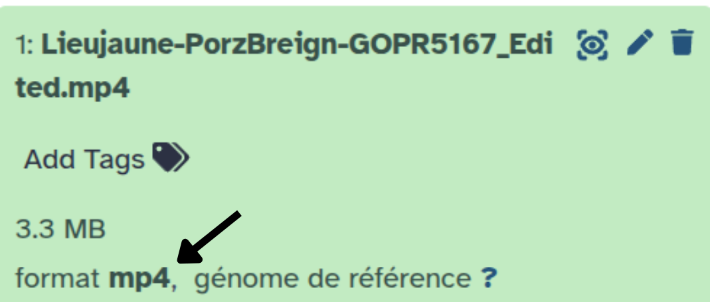
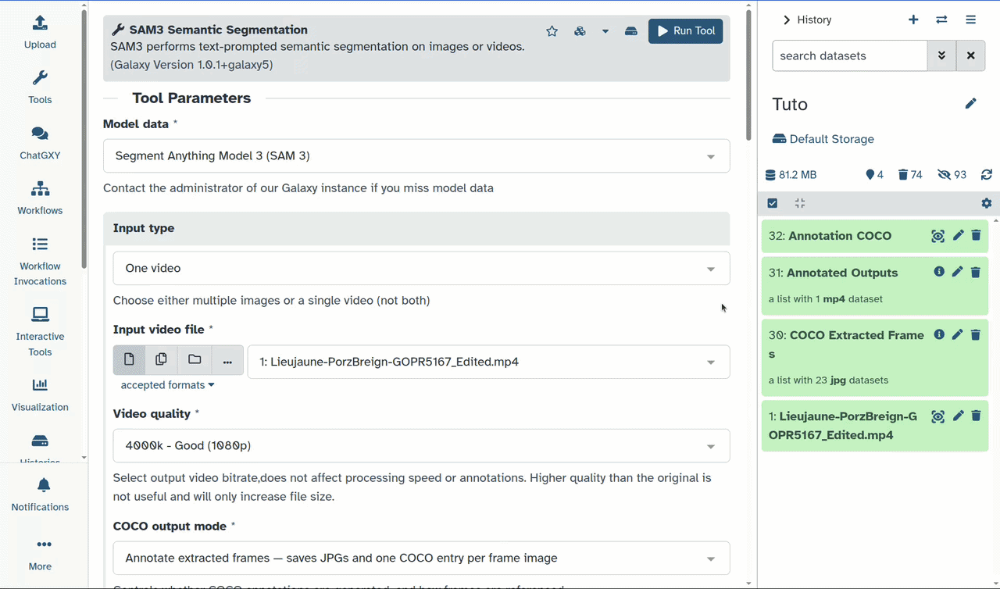

Dans ce tutoriel, nous allons explorer un pipeline complet pour l'annotation d'images et de vidéos d'espèces marines. Nous utiliserons comme exemple une vidéo issue du projet [Moorev](https://moorev.fr/), découpée et disponible sur Zenodo.

Ce pipeline se décompose en deux grandes étapes :
1. **Annotation automatique** par prompt textuel avec 
2. **Correction et validation** des annotations avec :
   - 
   - 

> <details-title>En savoir plus sur le projet MOOREV</details-title>
>
> **MOOREV** : Microclimats et outils d'observation des réponses du vivant sur les fonds marins 
> 
> **Observer les interactions entre espèces marines face aux gradients microclimatiques sur l'estran**
>
> Le projet MOOREV, porté par Nadine Le Bris (Sorbonne Université, Station Marine de Concarneau), 
> avec le soutien du Muséum National d'Histoire Naturelle, du CNRS et de la Fondation de France, 
> a été lancé en 2022. Son objectif : mieux comprendre et faire comprendre les effets des 
> perturbations climatiques sur la biodiversité du littoral.
>
> L'approche repose sur des méthodes d'imagerie sous-marine pour observer les espèces benthiques 
> à l'échelle individuelle, sur différents habitats de l'estran. Des groupes de scolaires 
> répètent des acquisitions de données sur leurs sites d'étude, labellisés par le programme 
> Aires Marines Éducatives de l'Office Français de la Biodiversité, au fil des cycles de marée, 
> des saisons et des années.
>
> Le projet associe chercheurs et professionnels de l'éducation à l'environnement, et est 
> co-construit avec des classes et leurs enseignants, en utilisant le littoral comme laboratoire 
> naturel. À terme, il vise à soutenir la mise en œuvre de mesures de protection et de 
> conservation, en tenant compte des interactions entre changement climatique et socio-écosystèmes 
> marins.
>
{: .details}

> <agenda-title>Dans ce tutoriel, nous allons couvrir :</agenda-title>
>
> 1. TOC
> {:toc}
>
{: .agenda}

# Chargement des données

La vidéo utilisée dans ce tutoriel est un extrait issu directement du projet Moorev, disponible sur Zenodo. Cet extrait a été sélectionné car il permet d'illustrer la majorité des fonctionnalités des outils présentés.

> <hands-on-title>Charger la vidéo dans Galaxy</hands-on-title>
>
> 1. Créez un nouvel historique pour ce tutoriel (par exemple : "Annotation Moorev")
> 
>    
>  
>    
> 
> 2. Importez le fichier depuis [Zenodo]({{ page.zenodo_link }}) :
>
>    ```
>    https://zenodo.org/records/20639741/files/Lieujaune-PorzBreign-GOPR5167_Edited.mp4?download=1
>    ```
>
>    
>
> 3. Vérifiez que le fichier apparaît en **vert** dans l'historique avant de continuer
>
> 4. Vérifiez le type de données
>
>    > <tip-title>Vérifier le type de données</tip-title>
>    >
>    > Le type de données est attribué automatiquement par Galaxy. Comme la majorité des outils l'utilisent pour filtrer leurs entrées, il est important de s'assurer qu'il est correct. Dans notre cas, vérifiez que le type est bien `mp4`. Si ce n'est pas le cas, l'import a peut-être rencontré une erreur, vous pouvez modifier le type manuellement.
>    >
>    > {: style="width:75%; display:block; margin:auto;"}
>    >
>    > 
>    >
>    {: .tip}
{: .hands_on}

# Annotation automatique avec SAM3

SAM3 est un modèle de segmentation guidé par texte. Il détecte et segmente automatiquement les objets correspondant à votre prompt, sans nécessiter d'annotations préalables.

> <tip-title>Un tutoriel dédié à SAM3 existe</tip-title>
>
> Si vous souhaitez en savoir plus sur SAM3 et ses paramètres, consultez le tutoriel dédié :
> [Tutoriel SAM3](https://training.galaxyproject.org/training-material/topics/ecology/tutorials/SAM3/tutorial.html)
>
{: .tip}

> <hands-on-title>Paramétrage de SAM3</hands-on-title>
>
> 1.  avec ces paramètres :
>
>    -  *"Model data"* : `Segment Anything Model 3 (SAM 3)` (par défaut)
>    -  *"Input type"* : `One video`
>    -  *"Input video file"* : `Lieujaune-PorzBreign-GOPR5167_Edited.mp4`
>    -  *"Video quality"* : `4000k - Good (1080p)`
>    -  *"COCO output mode"* : `Annotate extracted frames — saves JPGs and one COCO entry per frame image`
>    -  *"Additional output formats"* : `Empty` (par défaut)
>    -  *"Text prompt"* : `fish`
>    -  *"Confidence threshold"* : `0.5`
>    -  *"Video frame stride"* : `5`
>    -  *"Show bounding boxes on annotated output"* : `Yes`
>    -  *"Normalize outputs?"* : `No` (par défaut)
>
> 2. Cliquez sur **Execute**
>
>    > <comment-title>Temps de traitement</comment-title>
>    >
>    > Le traitement peut prendre plusieurs minutes selon la longueur de la vidéo et les ressources du serveur. Patientez jusqu'à ce que les sorties apparaissent en vert dans l'historique.
>    >
>    {: .comment}
>
> 3. Une fois terminé, vous obtenez dans votre historique :
>    - **32: Annotation COCO** : `annotations.json` — les masques de segmentation au format COCO
>    - **31: Annotated Outputs** : la vidéo annotée pour vérification visuelle
>    - **30: COCO Extracted Frames** : la collection d'images extraites (non annotées)
>
> 4. Vérifiez visuellement les résultats en cliquant sur  sur **Annotated Outputs**
>
>    {: style="width:75%; display:block; margin:auto;"}
>
>    > <comment-title>Limites de SAM3</comment-title>
>    >
>    > Comme vous pouvez le constater, toutes les annotations ne sont pas parfaites, les faux positifs sont le problème le plus fréquent. C'est pourquoi l'étape suivante de correction et validation est indispensable.
>    >
>    {: .comment}
>
{: .hands_on}

# Correction et validation des annotations

Nous allons voir 2 outils complémentaires pour corriger les annotations. Ils ne sont pas opposés : vous pouvez les utiliser l'un après l'autre, ou n'en utiliser qu'un seul selon vos besoins.

## Corriger avec Edit COCO Annotation

L'outil **Edit COCO Annotation** permet de modifier les annotations COCO sans avoir à ouvrir les images. Il propose trois modes :

- **Keep** : garder uniquement les IDs listés (supprimer tous les autres) — utile quand peu d'IDs sont à conserver, permet aussi de les renommer
- **Remove** : supprimer uniquement les IDs listés
- **Rename** : renommer les IDs listés sans en supprimer d'autres

> <hands-on-title>Garder, supprimer ou renommer des annotations</hands-on-title>
>
> 1.  avec ces paramètres :
>
>    -  *"Mode"* : `Keep - keep only listed IDs (remove all others)`
>    -  *"1: Track to keep"*
>        -  *"Track IDs"* : `0,4-6`
>        -  *"Rename"* : `Gobiusculus flavescens`
>        -  *"Frame min"* : `Empty` (par défaut)
>        -  *"Frame max"* : `Empty` (par défaut)
>    -  *"2: Track to keep"*
>        -  *"Track IDs"* : `2`
>        -  *"Rename"* : `Crenilabre`
>        -  *"Frame min"* : `Empty` (par défaut)
>        -  *"Frame max"* : `Empty` (par défaut)
>
>    > <comment-title>Résultat équivalent en deux étapes</comment-title>
>    >
>    > Il est aussi possible d'obtenir le même résultat en deux étapes : utiliser **Remove** pour supprimer les IDs 1 et 3, puis **Rename** pour renommer les groupes restants.
>    >
>    > À noter : SAM3 peut parfois attribuer le même Track ID à deux objets différents à des moments distincts de la vidéo. C'est pour cette raison que les paramètres **Frame min** et **Frame max** ont été ajoutés.
>    >
>    {: .comment}
>
> 2. Une fois terminé, vous obtenez dans votre historique :
>    - **58: Edited COCO annotations** : Le JSON format COCO modifier d'après les entrées
>
{: .hands_on}

### Visualiser les annotations avec COCO Annotation Visualizer

Cet outil permet de visualiser facilement un fichier JSON au format COCO superposé sur une vidéo ou des images. Nous l'utilisons ici pour vérifier nos annotations après correction.

> <hands-on-title>Visualiser les annotations COCO</hands-on-title>
>
> 1.  avec ces paramètres :
>
>    -  *"Input Type"* : `One Video`
>    -  *"Input video file"* : `Lieujaune-PorzBreign-GOPR5167_Edited.mp4`
>    -  *"Frame stride"* : `5`
>    -  *"COCO annotation file"* : `Edited COCO annotations`
>    -  *"Filter categories"* : `Empty` (par défaut)
>    - Dans *"Display options"* :
>        -  *"Show bounding boxes"* : `No`
>        -  *"Show segmentation masks"* : `Yes` (par défaut)
>        -  *"Show category labels"* : `Yes` (par défaut)
>        -  *"Show annotation count"* : `No` (par défaut)
>        -  *"Mask opacity"* : `0.4` (par défaut)
>        -  *"Bounding box thickness"* : `2` (par défaut)
>        -  *"Label font scale"* : `0.6` (par défaut)
>        -  *"Color mode"* : `Per instance (different color for each annotation)`
>        -  *"Output image format"* : `PNG (lossless)` (par défaut)
>    -  *"Output mode"* : `Both (frames and video)`
>    -  *"Video frame rate (FPS)"* : `5.0`
>    -  *"Annotated frames only"* : `Yes` (par défaut)
>
{: .hands_on}

## Corriger manuellement avec AnyLabeling

AnyLabeling est un outil interactif qui permet de corriger les annotations directement sur les images, incluant la modification des masques de segmentation. Il offre plus de liberté qu'Edit COCO, mais demande plus de temps.

> <comment-title>Limites d'AnyLabeling pour les vidéos</comment-title>
>
> AnyLabeling présente deux limitations importantes dans ce contexte :
> - La conversion du format COCO vers LabelMe entraîne la **perte des Track IDs**
> - AnyLabeling n'est pas conçu pour les vidéos : sans tracking, vous devrez corriger les annotations **frame par frame**
>
{: .comment}

### Convertir les annotations COCO en format LabelMe

Le format COCO est un unique fichier JSON contenant toutes les annotations. Le format LabelMe, lui, requiert **un fichier JSON par frame**, nommé exactement comme l'image correspondante (à l'extension près).

> <hands-on-title>Conversion COCO vers LabelMe</hands-on-title>
>
> 1.  avec ces paramètres :
>
>    -  *"COCO annotation file"* : `Annotation COCO`
>    -  *"Image path mode"* : `Custom - user defined base path`
>    -  *"Custom base path"* : `Empty` (laisser vide)
>
>    > <comment-title>Pourquoi laisser le chemin vide ?</comment-title>
>    >
>    > AnyLabeling cherche les images dans le même dossier que les annotations. En laissant le chemin vide, le nom de la frame est utilisé directement, ce qui correspond à l'organisation des fichiers dans l'outil interactif.
>    >
>    {: .comment}
>
{: .hands_on}

### Corriger les annotations avec AnyLabeling

AnyLabeling est un outil interactif : Galaxy lance une application dans un environnement virtuel que vous contrôlez depuis votre navigateur. Une fois vos corrections terminées, vous fermez l'application et les données sont renvoyées dans votre historique Galaxy.

> <hands-on-title>Annotation manuelle via AnyLabeling</hands-on-title>
>
> 1.  avec ces paramètres :
>
>    -  *"Input images"* : `COCO Extracted Frames`
>    -  *"Pre-existing annotations"* : `LabelMe JSON annotations`
>    -  *"Classes file (one class per line)"* : `Empty` (par défaut)
>    -  *"A tarball containing custom model files and yaml files"* : `Empty` (par défaut)
>
{: .hands_on}

# Conclusion

Vous savez maintenant utiliser ce pipeline complet pour annoter des vidéos d'espèces marines :

- **SAM3** génère automatiquement des annotations à partir d'un simple prompt textuel
- **Edit COCO** permet de nettoyer rapidement les annotations en gardant, supprimant ou renommant des IDs de tracks
- **COCO Annotation Visualizer** permet de vérifier visuellement les résultats à chaque étape
- **AnyLabeling** offre une correction manuelle fine, frame par frame, pour les cas complexes

Ce pipeline est réutilisable pour d'autres espèces ou d'autres projets d'imagerie marine — il suffit d'adapter le prompt et les paramètres de confiance de SAM3.